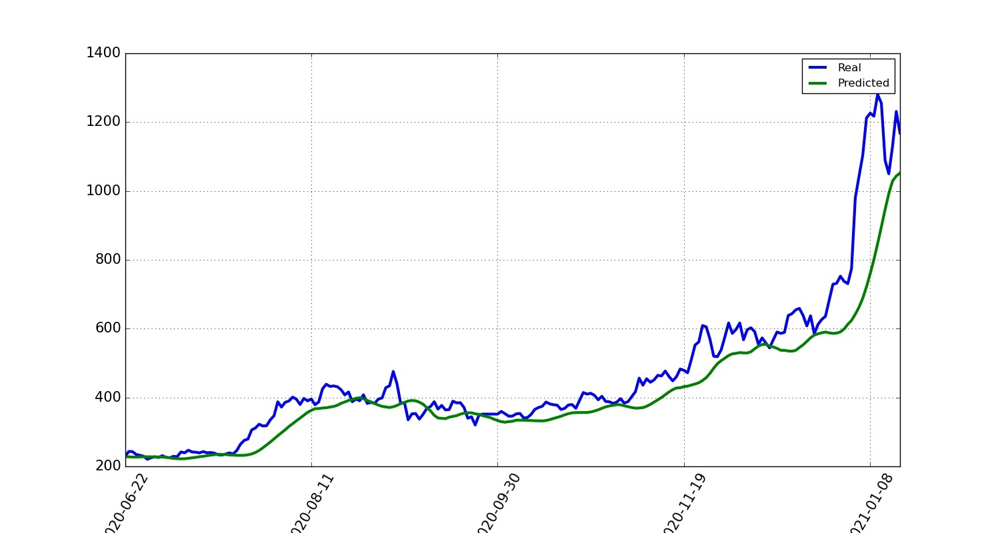
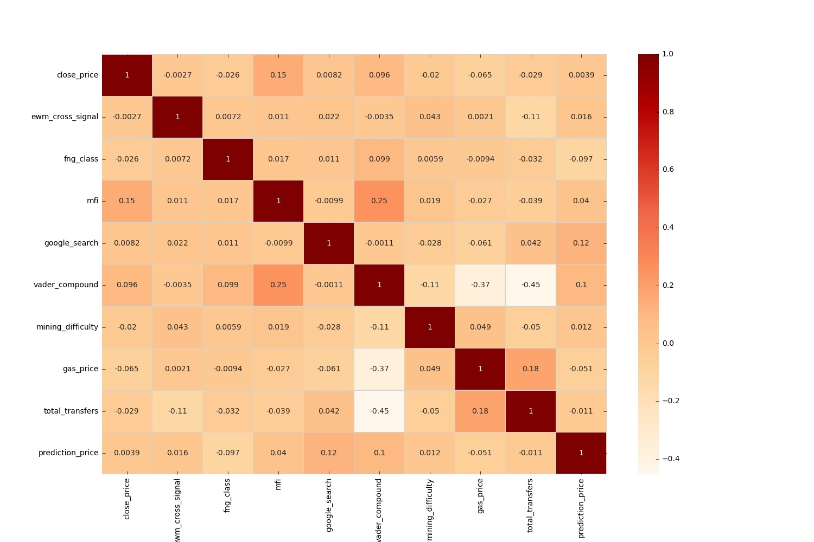
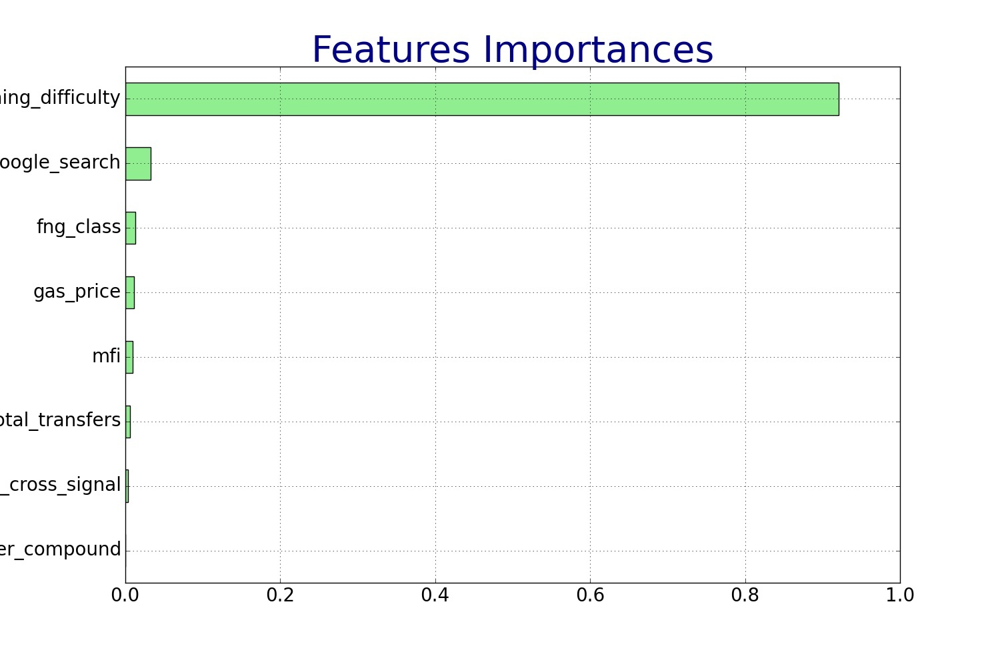
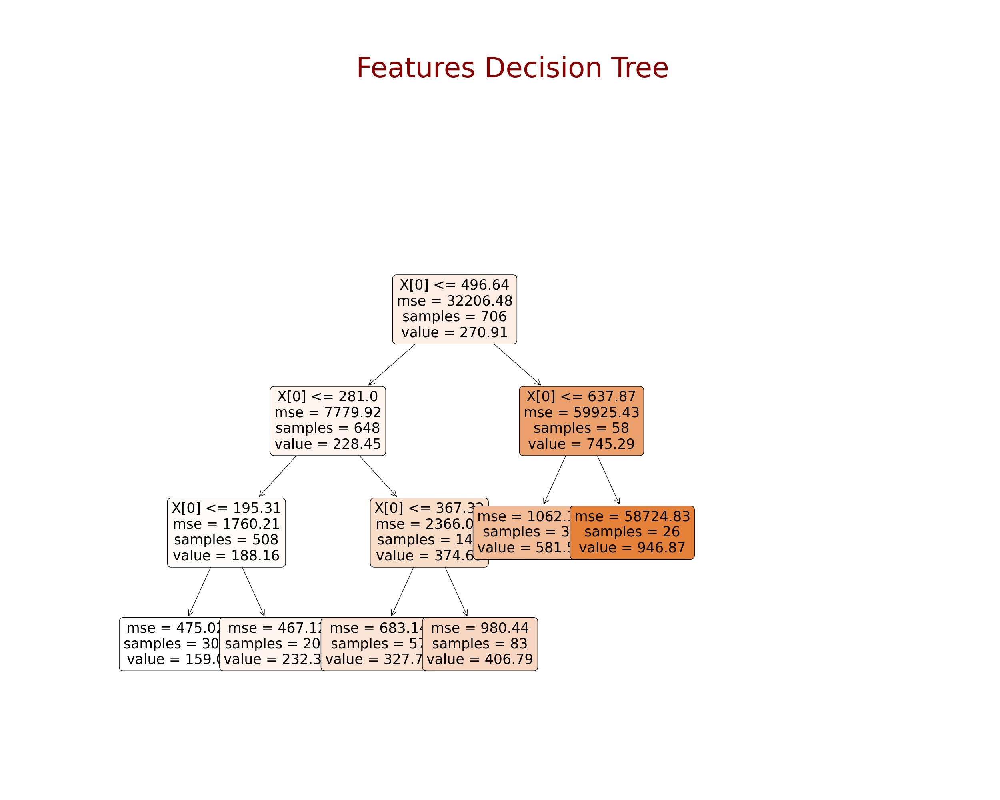
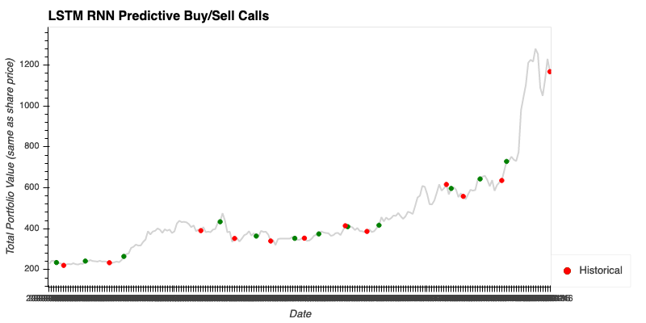
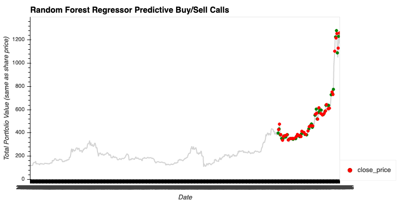
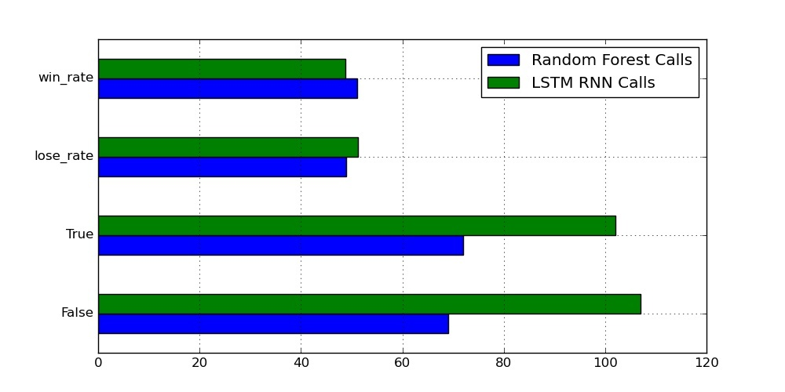

# Daily Direction Algorithm (DDA) 

### *A Machine Learning Project to Predict a Cryptocurrency’s Positive/Negative Movement*

>**Hypothesis:** Can cryptocurrency on-chain data paired with technical indicators fit to a Machine Learning model be a reliable predictor of the next daily close? Is historical pricing the best indicator of a next day cryptocurrency price?

The three Proof of Work currencies selected for the purposes of this project are:
1. BTC
2. ETH
3. DASH

## The Models
___
* We utilized two predictive models - The *Random Forest Regressor (RF)* for features analysis and the *Long Short-Term Memory Recurrent Neural Network (LSTM RNN)* for historical price comparison.

<<<<<<< HEAD
* Backtesting - Comparative study between the outcome of investing with the model's calls vs [*hodling*](https://en.wikipedia.org/wiki/Hodl) the given currency.

## Model Set Up and Instructions
___

### Data Prep
1. Import numpy, pandas, hvplot, datetime, functools and sklearn to start off with the model.
2. Load the fear and greed sentiment data for the the currency (only fear and greed index)
3. Load the vader sentiment analysis for the currency.
4. Load the historical closing prices for the currency
5. Load the exponential moving average for the currency
6. Using the MFI source, load the money flow index for the currency
7. Load the money Flow index for the currency
8. Merge the closing price, ewm, fng, mfi, and Google dataframe into a single dataframe. Name it currency_df.

### Loading Features from CSVs
note: this model can be used with any features selected by the user as long as these can be concatenated into a single dataframe. The features information was pulled from [Google BigQuery](https://console.cloud.google.com/). We picked the below:
1. Load the **gas price** data for the currency
2. Load the **mining difficulty** data for the currency
3. Load the **actual value** (load of transactions) data for the currency
4. Merge the previous three features (value, gas and mining difficulty) into a single feautures DataFrame.
5. Create a master dataframe by merging the features DataFrame and currency_df.

> Great Job! Now we have a master dataframe to work with in our *Random Forest Regressor (RF)* for features analysis and the *Long Short-Term Memory Recurrent Neural Network (LSTM RNN)* for historical price comparison. Ready? Lets do this!

### Random Forest Regressor for Multiple Features
**1. More Imports**
* Import sklearn.ensemble, sklearn.model_selection (cross_val_score, GridSearchCV, train_test_split), sklearn.preprocessing (MinMaxScaler)
* Import sklearn.metrics: confusion_matrix, accuracy_score, classification_report
* Import sklearn.datasets (load_boston)
* Import shap
* Import matplotlib.pyplot as plt
* Import seaborn as sns

**2. Fitting and Predicting**
* Define features set and target vector
* Run trains and splits
* Create Random Forest Regressor and fit the model
* Create a predictions variable using the test data (X_test)

**3. Features Importances**
* Calculate features importances. Random Forests in sklearn automatically calculate this with *.feature_importances_*
* Clean the features importances dataframe and plot it as a bar chart (barh)
* plot shap_values

**4. Model Evaluation**
* Calculate the mean squared error with sklearn.metrics and the rmse
* Join/merge/append all dataframes to derive the master percent change correlation dataframe
* Plot feautures importances heatmap

**5. Features Decision Tree**
* Import DecisionTreeRegressor from sklearn
* Prepare the dataset to fit regr.fit(X,y)
* Plot the currency feautures decision tree

### LSTM Recurrent Neural Network for Historical and Predicted Closing Prices
**Prepare the data for LSTM**
1. Import Sequential from tensorflow models and LSTM, Dens, Dropout from tensorflow layers. Import seed from numpy, random from tensorflow, and the MinMaxScaler from Sklearn Preprocessing
2. Set the random seed for reproductibility
3. Create function for features (X) and target (y)
4. Predict closing prices by defining the window size
5. Use 70% of the data for training and the remainder for testing
6. Use MinMaxScaler to scale data between 0 and 1
7. Reshape the features for the model

**Build and Train the Model**
1. Create a "model" df and equal it to Sequential()
2. Set up the number of units and dropout fraction to set up the model
3. Define three layers for the model and the output layer
4. Compile and summarize the model

**Model Performance**
1. Use evaluate and predict to evaluate and make predictions on the model
2. Recover the real prices instead of the scaled version
3. Create a dataframe of Real and Predicted values
4. Plot the price comparison dataframe

### Backtesting LSTM - RF (performed on this model for ETH only)
1. Define an initial investment (price of eth) at first predicted buy call. Hold until the sell signal. 
2. Buy and sell on each of the buy and sell calls that the algorithm predicted
3. Sum the position size of the buys and sells to get our profit
4. Compare the statisitc to the final price of ETH at the end of our dataframe

### Compare the Models Accuracy Test
1. Concat the LSTM and Random Forest Regression results
2. Plot the call accuracy by model

## Sample Data Visualizations (ETH)
=======
* We performed *backtesting* to compare the outcome of investing in a given currency with our model's value prediction for that currency as well as the opposite case scenario in which we would hold the currency instead of buying or selling it according to the model predictions.

>>>>>>> d6bba49fe5bae372efcfb263e6dfc757cea8be4e
____
### Ethereum (ETH)

#### LSTM Analysis

#### Random Forest Test (Heat Map)

#### Decision Tree

#### Backtest

#### Win Vs Lose

**Note.-**
* If the predicted price had a positive movement in price and the actual price had a positive movement in price then we had a TRUE CALL. 
* If the predicted price had a negative movement in price and the actual price had a negative movement then we again have a TRUE CALL.
* If though, the predicted price and the actual price had inverse movements then we would have a FALSE CALL.
* Win/Lose is the percentage change of the “true”/”false” call.

## To Discuss
____
- For the LSTM model, BTC had the higher win rate out of the three cryptocurrencies with a 55% win rate. 

- The random forest test, Dash got the higher win rate with a 54% win rate. 

- Overall, notice that for the Random Forest test the win rate is higher on all three coins tested. This means that through FR, we are able to get more reliable results.

- What the data showed or did not show: data validated our initial hypotheses, with some exceptions and caveats.

# Conclusions
____
- There are positive signs that various features are a better indicator than only closing price to predict crypto on a near future baisis.

- This test would need to run with more crypto currencies in order to create a higher reliability on the tool’s accuracy to predict this, but due to time constraints we did not include more currencies in the test.

## Sources
____

**[Google BigQuery](https://console.cloud.google.com/) (Google Cloud Platform):** Service platform that supports querying using ANSI SQL. Used to extract data on each currency such as mining difficulty, value, size, and the timestamp for each. 

**[Reddit_NLP](https://www.reddit.com/) (Reddit):** Used for sentiment Analysis through Natural Language Process. Reddit is a social news aggregation, web content rating, and discussion website.

**[Kraken API_Price](https://support.kraken.com/hc/en-us) (Kraken):** Used to encrypt our communication with the API.

**[MFI](https://randerson112358.medium.com/algorithmic-trading-strategy-using-money-flow-index-mfi-python-aa46461a5ea5) (MFI):** Playbook to calculate MFI data

**[Fear&Greed](https://alternative.me/crypto/fear-and-greed-index/) (Sentiment):** Patform for optimizing connections between a variety of software and product alternatives.

| Project by |
|-----------:|
| Andrea Asbun |
| Collin Holben |
| Jeff Myers |
| Cathy Slider |
