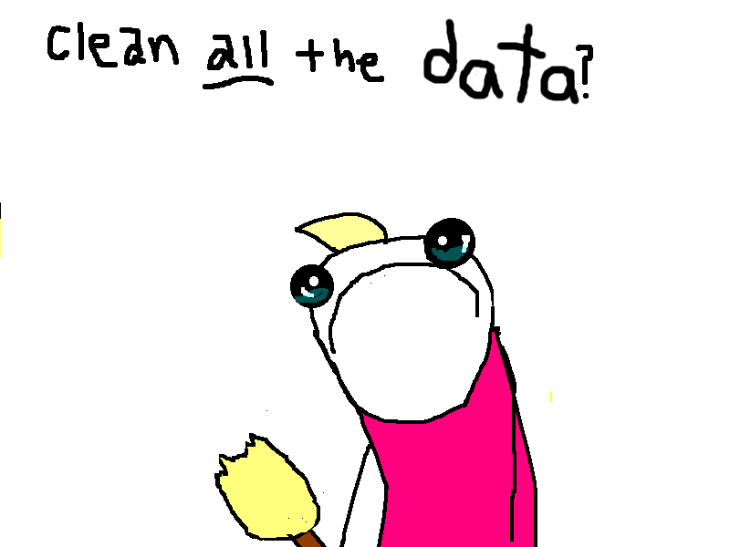

# Daily Direction Algorithm (DDA) 

### *A Machine Learning Project to Predict a Cryptocurrency’s Positive/Negative Movement*

>**Hypothesis:** Can cryptocurrency on-chain data paired with technical indicators fit to a Machine Learning model be a reliable predictor of the next daily close? Is historical pricing the best indicator of a next day cryptocurrency price?

The three Proof of Work currencies selected for the purposes of this project are:
1. BTC
2. ETH
3. DASH

## The Models
___
* Here I've utilized two predictive models - The *Random Forest Regressor (RF)* for features analysis and the *Long Short-Term Memory Recurrent Neural Network (LSTM RNN)* for historical price comparison.

* Backtesting - Comparative study between the outcome of investing with the model's calls vs [*hodling*](https://en.wikipedia.org/wiki/Hodl) the given currency.

## Model Set Up and Instructions
___

### Data Prep
1. Import numpy, pandas, hvplot, datetime, functools and sklearn to start off with the model.
2. Load the fear and greed sentiment data for the the currency (only fear and greed index)
3. Load the vader sentiment analysis for the currency.
4. Load the historical closing prices for the currency
5. Load the exponential moving average for the currency
6. Using the MFI source, load the money flow index for the currency
7. Load the money Flow index for the currency
8. Merge the closing price, ewm, fng, mfi, and Google dataframe into a single dataframe. Name it currency_df.

## Sources
____

**[Google BigQuery](https://console.cloud.google.com/) (Google Cloud Platform):** Service platform that supports querying using ANSI SQL. Used to extract data on each currency such as mining difficulty, value, size, and the timestamp for each. 

**[Reddit_NLP](https://www.reddit.com/) (Reddit):** Used for sentiment Analysis through Natural Language Process. Reddit is a social news aggregation, web content rating, and discussion website.

**[Kraken API_Price](https://support.kraken.com/hc/en-us) (Kraken):** Used to encrypt our communication with the API.

**[MFI](https://randerson112358.medium.com/algorithmic-trading-strategy-using-money-flow-index-mfi-python-aa46461a5ea5) (MFI):** Playbook to calculate MFI data

**[Fear&Greed](https://alternative.me/crypto/fear-and-greed-index/) (Sentiment):** Patform for optimizing connections between a variety of software and product alternatives.
